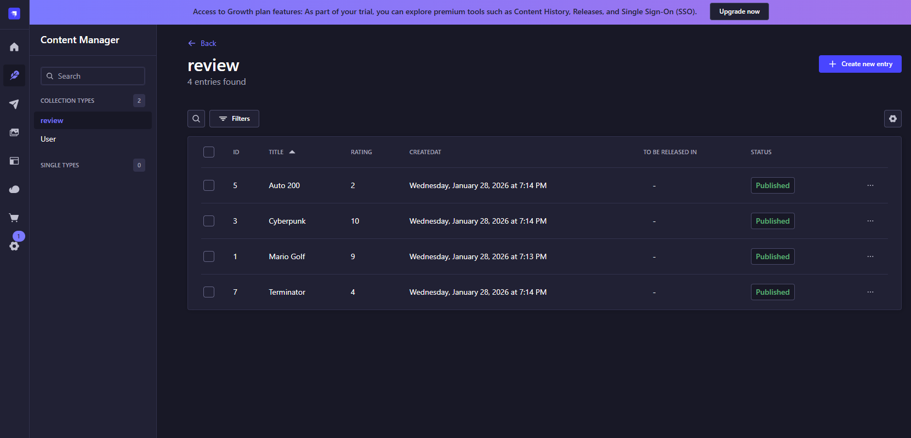

# React Strapi 5 GraphQL Reviews

A modern, type-safe review site built with **React** and **TypeScript**. This project fetches content from **Strapi 5** using **GraphQL** for optimized data delivery.

## 📂 Project Structure

```text
react-strapi-graphql-site/
├── backend/                    # Strapi 5 headless CMS
│   ├── config/
│   │   ├── admin.ts           # Admin panel configuration
│   │   ├── api.ts             # API configuration
│   │   ├── database.ts        # Database connection settings
│   │   ├── middlewares.ts      # Middleware configuration
│   │   ├── plugins.ts         # Plugin configuration
│   │   └── server.ts          # Server configuration
│   ├── src/
│   │   ├── api/
│   │   │   └── review/        # Review content type
│   │   │       ├── content-types/
│   │   │       │   └── review/schema.json
│   │   │       ├── controllers/review.ts
│   │   │       ├── routes/review.ts
│   │   │       └── services/review.ts
│   │   ├── admin/             # Admin panel customization
│   │   ├── extensions/        # Strapi extensions
│   │   └── index.ts           # Entry point
│   ├── types/
│   │   └── generated/         # Auto-generated TypeScript types
│   ├── public/
│   │   ├── robots.txt
│   │   └── uploads/           # Media uploads
│   ├── database/
│   │   └── migrations/        # Database migrations
│   ├── package.json
│   ├── tsconfig.json
│   └── .env                   # Environment variables
│
├── frontend/                   # React + TypeScript frontend
│   ├── public/
│   │   ├── index.html
│   │   ├── manifest.json
│   │   └── robots.txt
│   ├── src/
│   │   ├── graphql/
│   │   │   └── queries.ts     # Centralized GraphQL query definitions
│   │   ├── types/
│   │   │   └── review.ts      # TypeScript interfaces for Review data
│   │   ├── pages/
│   │   │   ├── Homepage.tsx   # Review listing with content snippets
│   │   │   └── ReviewDetails.tsx # Full review view by documentId
│   │   ├── components/
│   │   │   └── SiteHeader.tsx # Reusable header component
│   │   ├── hooks/
│   │   │   └── useFetch.ts    # Utility for standard REST fetching
│   │   ├── App.tsx            # Root component
│   │   ├── index.tsx          # Apollo Client and Provider configuration
│   │   ├── index.css          # Global styles
│   │   └── setupTests.ts      # Test configuration
│   ├── package.json
│   ├── tsconfig.json
│   ├── tailwind.config.js     # Tailwind CSS configuration
│   ├── postcss.config.js      # PostCSS configuration
│   └── .env                   # Environment variables
│
└── README.md
```

## 🚀 Features

- **Strapi 5 Document Service:** Uses `documentId` for stable, SEO-friendly routing.
- **Apollo Client Integration:** Efficient data fetching with built-in caching.
- **Type-Safe Schema:** Full TypeScript support for Strapi's "Blocks" (JSON) content.
- **GraphQL API:** Requests only the fields required, reducing payload size.

---

## 🛠️ Tech Stack

- **Frontend:** React, TypeScript, React Router 6, Tailwind CSS
- **API Client:** Apollo Client (GraphQL)
- **Backend:** [Strapi 5](https://strapi.io/)
- **Content:** Strapi Blocks (Rich Text)

---

## 📦 Getting Started

### 1. Backend Setup (Strapi)

1. Ensure you have the GraphQL plugin installed in your Strapi directory:

```bash
npm install @strapi/plugin-graphql

```

2. Run the develop server:

```bash
npm run develop

```

3. **Permissions:** In the Strapi Admin, go to `Settings > Roles > Public`. Enable **find** and **findOne** for the **Review** collection.

### 2. Frontend Setup (React)

1. Install dependencies:

```bash
npm install

```

2. Start the development server:

```bash
npm start

```

---

## 📑 GraphQL Schema Summary

The project interacts with the following `Review` schema:

| Field        | Type    | Description                             |
| ------------ | ------- | --------------------------------------- |
| `documentId` | ID!     | The unique identifier for the document. |
| `title`      | String! | Review title.                           |
| `rating`     | Int!    | Numeric score.                          |
| `body`       | JSON!   | Strapi Blocks rich text data.           |

---

## 📡 Example Query

Data is fetched using the following query structure in `src/graphql/queries.ts`:

```graphql
query GetReviews {
  reviews {
    documentId
    title
    rating
    body
  }
}
```

---

## 🔧 Scripts

- `npm start`: Runs the app in development mode.
- `npm run build`: Optimizes the app for production.
- `npm test`: Launches the test runner.

## 🖼️ Screenshots




## 📄 License

Distributed under the MIT License.
